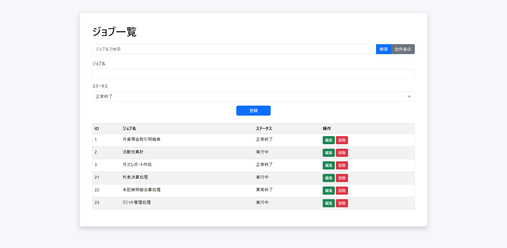
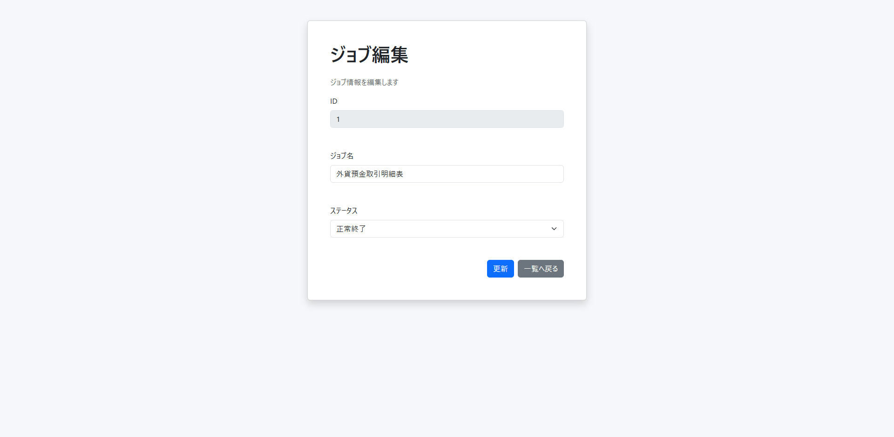

# Job Manager

## アプリ概要

ジョブ管理アプリ

---

## 使用技術

| 技術 | バージョン / 内容 |
|------|-------------------|
| Java | 21 |
| Spring Boot | 3.5 |
| Spring Data JPA | ORM |
| Oracle Database Free | データベース |
| Thymeleaf | テンプレートエンジン |
| Bootstrap | UIデザイン |
| Maven | ビルドツール |
| Git / GitHub | バージョン管理 |

---

## 機能一覧

- ジョブ一覧表示
- ジョブ登録
- ジョブ更新
- ジョブ削除
- ジョブ検索

---

## 画面イメージ

### ジョブ一覧



### ジョブ更新



---

## テーブル定義

### JOB

| カラム名 | 型 | 説明 |
|---------|----|------|
| ID | NUMBER | ジョブID |
| JOB_NAME | VARCHAR2(100) | ジョブ名 |
| STATUS | VARCHAR2(20) | ステータス |

---

## システム構成

```text
Browser

↓

Thymeleaf

↓

Controller

↓

Service

↓

Repository
(Spring Data JPA)

↓

Oracle Database Free
```

---

## 今後の改善案

- Spring Securityによるログイン機能追加
- Dockerによるコンテナ化
- Oracle Cloud Databaseへの移行
- Render等へのデプロイ
- バリデーション機能追加